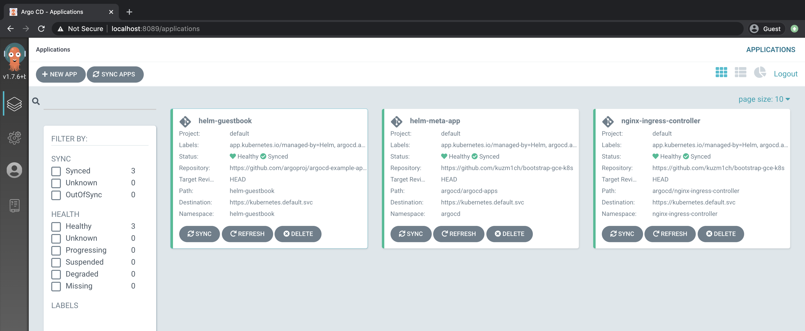

# bootstrap-gce-k8s

## Prerequisite
* kubectl, gcloud, terraform installed
* GCP cloud account project. To use your gcloud credentials, run run 'gcloud auth application-default login'


## Usage
```
cd terraform
terraform init
terraform plan # will ask you to provide project_id
terraform apply
```
In the end it will bootstrap kubernetes cluster with argocd installed.
Argocd is configured to look on argocd/argocd-apps meta application.  
If you need to add additional argocd applications change argocd/argocd-apps and it will be synced. No need to rerun terraform.


## TODO
* Seperate argocd applications templates and argocd meta application template
* Bootstrap terraform remote storage
* Move hardcoded values to variables(ip_ranges, network_name etc).For now it is in most cases hardcoded to keep it simple.

## NOTES
In case of error like this, do needful(enable service as described). Btw, it can be related to project quota(Free Tier).
```
Error: googleapi: Error 403: Compute Engine API has not been used in project 1044564992054 before or it is disabled. Enable it by visiting https://console.developers.google.com/apis/api/compute.googleapis.com/overview?project=1044564992054 then retry. If you enabled this API recently, wait a few minutes for the action to propagate to our systems and retry., accessNotConfigured

  on .terraform/modules/gke/main.tf line 22, in data "google_compute_zones" "available":
  22: data "google_compute_zones" "available" {
```

## Output
```
kubectl port-forward svc/argo-cd-argocd-server -n argocd 8089:80
```
http://localhost:8089
```
login: admin
password: argocd-server-pod-name
```

